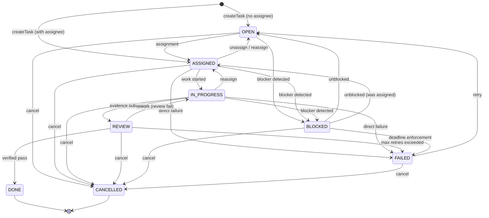

# Task Lifecycle

How tasks move through ClawForce from creation to completion.

## State Machine



## Transitions Table

| From | To | Condition | Who |
|---|---|---|---|
| OPEN | ASSIGNED | Agent available | System (auto-assign) or lead |
| OPEN | BLOCKED | Dependency or stale-block | System |
| OPEN | CANCELLED | Manual cancel | Any actor |
| ASSIGNED | IN_PROGRESS | Work begins | Assigned agent |
| ASSIGNED | OPEN | Unassign / reassign | Lead or system |
| ASSIGNED | BLOCKED | Dependency | System |
| ASSIGNED | FAILED | Fatal error | Agent or system |
| ASSIGNED | CANCELLED | Manual cancel | Any actor |
| IN_PROGRESS | REVIEW | **Evidence required** | Assigned agent |
| IN_PROGRESS | ASSIGNED | Reassignment | Lead |
| IN_PROGRESS | BLOCKED | Dependency | System |
| IN_PROGRESS | FAILED | Fatal error | Agent or system |
| IN_PROGRESS | CANCELLED | Manual cancel | Any actor |
| REVIEW | DONE | **Verifier gate** (different actor) | Verifier agent |
| REVIEW | IN_PROGRESS | Rework needed (**verifier gate**) | Verifier agent |
| REVIEW | FAILED | Max retries hit (**verifier gate**) | Verifier agent |
| REVIEW | CANCELLED | Manual cancel | Any actor |
| BLOCKED | OPEN | Blockers resolved | System (sweep) |
| BLOCKED | ASSIGNED | Blockers resolved (had assignee) | System |
| BLOCKED | FAILED | Deadline exceeded | System (sweep) |
| BLOCKED | CANCELLED | Manual cancel | Any actor |
| FAILED | OPEN | Retry (if `retryCount < maxRetries`) | System or lead |
| FAILED | CANCELLED | Permanently abandon | Any actor |

## Validation Rules

The state machine enforces four policy checks on every transition:

1. **Structural validity** -- the `from -> to` pair must exist in the transitions table. Invalid transitions return `INVALID_TRANSITION`.

2. **Verifier gate** -- transitions out of REVIEW (to DONE, FAILED, or IN_PROGRESS) require the actor to be a different agent than the task assignee when `verificationRequired` is true. Self-grading is blocked with `VERIFIER_GATE`. Self-review can be allowed via config (`review.selfReviewAllowed`) for lower-priority tasks.

3. **Evidence required** -- IN_PROGRESS to REVIEW requires at least one evidence attachment. Returns `EVIDENCE_REQUIRED` if no evidence exists.

4. **Retry exhausted** -- FAILED to OPEN checks `retryCount >= maxRetries`. Returns `RETRY_EXHAUSTED` when the limit is hit. Default max retries: 3.

Additional gates enforced by `transitionTask()` (outside the state machine):

- **Workflow phase gate** -- tasks in a future workflow phase cannot move to ASSIGNED or IN_PROGRESS until the current phase completes.
- **Parent dependency gate** -- a child task cannot start (IN_PROGRESS) until its parent task is DONE.
- **Risk gate** -- high-risk transitions may require human approval via the proposal system.

## Evidence Model

Evidence is attached to tasks before they can enter REVIEW.

### Evidence Types

| Type | Purpose | Example |
|---|---|---|
| `output` | Raw command/tool output | Build logs, API responses |
| `diff` | Code changes | Git diff of modified files |
| `test_result` | Test execution results | Vitest/Jest output |
| `screenshot` | Visual proof | Dashboard screenshot |
| `log` | Execution logs | Session transcript |
| `custom` | Anything else | Freeform notes |

### Evidence Properties

Each evidence record contains:
- `id` -- unique identifier
- `taskId` -- the task it belongs to
- `type` -- one of the types above
- `content` -- the evidence payload (string)
- `contentHash` -- dedup hash of content
- `attachedBy` -- agent who attached it
- `attachedAt` -- timestamp
- `metadata` -- optional key-value data

### Who Attaches Evidence

The assigned agent attaches evidence during IN_PROGRESS via the `clawforce_task` tool or the SDK `tasks.attach()` method. Evidence is validated against schema rules before acceptance.

## Verification Gates

When a task enters REVIEW, the event router (`task_review_ready` handler) looks for a verifier:

1. Check `review.verifierAgent` in domain config for an explicit verifier
2. Fall back to regex matching against registered agent IDs (`/verifier|reviewer/i`)
3. If no verifier is found, the task stays in REVIEW for manual handling

The verifier receives a prompt containing the task title, description, and evidence summary. It either transitions the task to DONE (pass) or back to IN_PROGRESS (rework needed). After max retries, the task moves to FAILED and may be escalated via `replan_needed` events.

Verification commands (tests, typecheck, lint) can also be configured per-domain:

```yaml
verification:
  gates:
    - name: typecheck
      command: "npx tsc --noEmit"
      required: true
    - name: tests
      command: "npx vitest run"
      required: true
```

## Task Priorities

| Priority | Meaning | Dispatch Behavior |
|---|---|---|
| P0 | Critical | Dispatched first, bypasses pacing |
| P1 | High | Dispatched before P2/P3 |
| P2 | Medium (default) | Standard pacing |
| P3 | Low | Dispatched last |

Priority affects dispatch queue ordering. The queue is FIFO within the same priority level. Re-enqueued tasks from approved proposals use priority 0 (highest).

## Parent/Child Dependencies

Tasks can have a `parentTaskId`. When set:

- The child task **cannot start** (transition to IN_PROGRESS) until the parent is DONE.
- Parent must exist in the same project -- creation fails if `parentTaskId` is invalid.
- This is separate from workflow phases, which gate entire groups of tasks.

### Dependency DAG

Fine-grained dependencies beyond parent/child are managed via `task_dependencies`:

- **blocks** (hard) -- the dependent task cannot proceed until the blocker is DONE. When a blocker completes, `cascadeUnblock` auto-transitions blocked dependents to OPEN.
- **soft** (advisory) -- tracked for visibility but not enforced by the system.

Cycles are detected and rejected at creation time. The sweep service also auto-recovers blocked tasks when all hard blockers are resolved.

## Task Origins

Every task records how it entered the system:

| Origin | Description |
|---|---|
| `user_request` | User collaborated with lead to define work |
| `lead_proposal` | Lead proposed work (requires approval) |
| `reactive` | Auto-created in response to failures or bugs |

This enables budget accountability -- every dollar traces back to an approved intent.
