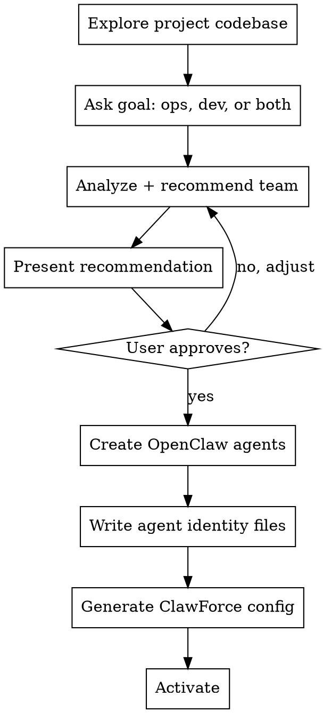

# Onboard a Project to ClawForce

Guide the user through onboarding a project to ClawForce: analyze their codebase, recommend an agent team, create OpenClaw agents, and generate ClawForce governance config.

## Flow



## Step 1: Explore Project

Scan the codebase to understand what you're governing:

- **Package files**: `package.json`, `pyproject.toml`, `Cargo.toml`, etc.
- **README / docs**: project purpose, architecture
- **Source structure**: major modules, subsystems
- **Infrastructure**: Docker, CI/CD, cloud deployments, databases
- **Scheduled jobs**: crons, EventBridge rules, launchd
- **Entry points**: services, scripts, pipelines

Summarize findings to the user before proceeding.

## Step 2: Ask Goal

One question: "What do you want agents to do?"

- **Ops** — monitor, maintain, operate what's already running
- **Dev** — build features, fix bugs, write tests
- **Both** — ops agents running the system + dev agents building on it

## Step 3: Recommend Team

Based on project analysis + goal, recommend:

- **One manager** with jobs: dispatch (every 5min), reflect (weekly), ops (hourly)
- **Domain-specific employees** mapped to project subsystems
- **Budget** based on team size

Present as a table:

```
| Agent | Role | Covers |
|-------|------|--------|
| proj-lead | manager | Coordinates team, reviews, escalations |
| proj-backend | employee | Backend services, API, database |
| proj-ops | employee | Monitoring, health checks, deploys |
```

Use opinionated defaults. User tweaks later, not during onboarding.

## Step 4: Create OpenClaw Agents

For each recommended agent:

### 4a. Check existing agents

```bash
openclaw agents list --json
```

Reuse any agent that already exists with a matching name.

### 4b. Create new agents

```bash
openclaw agents add <agent-name> --non-interactive
```

### 4c. Copy auth

Copy `auth-profiles.json` from the source agent (default: `main`) to each new agent:

```bash
cp ~/.openclaw/agents/main/agent/auth-profiles.json ~/.openclaw/agents/<agent-name>/agent/auth-profiles.json
```

## Step 5: Write Agent Identity Files

For each agent, write files to its workspace directory. The workspace path can be found via `openclaw agents list --json` or defaults to `~/.openclaw/agents/<name>/workspace/`.

### SOUL.md

Tailored to role and project. Template:

```markdown
# Soul

You are [agent name], the [role description] for [project name].

## What You Do
[2-3 sentences about this agent's domain and responsibilities]

## How You Work
- You report to [manager agent name]
- You use ClawForce tools to track your work (clawforce_task, clawforce_log)
- You transition tasks through their lifecycle: ASSIGNED → IN_PROGRESS → REVIEW → DONE
- You attach evidence to completed tasks

## What You Value
- Thoroughness — verify your work before marking done
- Communication — message your manager when blocked or when something unexpected happens
- Accountability — log decisions and outcomes
```

### AGENTS.md

Operational guide with ClawForce instructions:

```markdown
# Agent Operating Guide

## ClawForce Integration

You are part of a governed agent team. Every action is tracked for accountability.

### Task Lifecycle
1. Check your assigned task: it appears in your briefing
2. Transition to IN_PROGRESS when you start: `clawforce_task transition`
3. Log your work: `clawforce_log write`
4. Attach evidence when done: `clawforce_task attach_evidence`
5. Transition to REVIEW: `clawforce_task transition`

### Communication
- Message your manager: `clawforce_message send`
- Check pending messages: they appear in your briefing
- Escalate blockers: `clawforce_message send` with priority "urgent"

### Memory
- Write daily notes to memory/YYYY-MM-DD.md
- Keep MEMORY.md updated with long-term learnings
- Use memory_search to find relevant past context
```

### IDENTITY.md

Pre-filled identity:

```markdown
name: [agent-name]
emoji: [appropriate emoji for the role]
vibe: [one-word vibe: "focused", "vigilant", "analytical", etc.]
```

### USER.md

Copy from source agent's USER.md:

```bash
cp ~/.openclaw/agents/main/workspace/USER.md ~/.openclaw/agents/<agent-name>/workspace/USER.md
```

### No BOOTSTRAP.md

Do NOT create BOOTSTRAP.md. The agent is pre-configured and doesn't need a first-run conversation.

## Step 6: Generate ClawForce Config

### Global config: `~/.clawforce/config.yaml`

```yaml
agents:
  proj-lead:
    title: "Project Lead"
    extends: manager
  proj-backend:
    title: "Backend Developer"
    extends: employee
    reports_to: proj-lead
  proj-ops:
    title: "Operations Specialist"
    extends: employee
    reports_to: proj-lead
```

### Domain config: `~/.clawforce/domains/<project>.yaml`

```yaml
domain: project-name
agents: [proj-lead, proj-backend, proj-ops]

budget:
  project:
    daily:
      cents: 3000
  agents:
    proj-lead:
      daily:
        cents: 1500
    proj-backend:
      daily:
        cents: 1000
    proj-ops:
      daily:
        cents: 500

manager:
  enabled: true
  agentId: proj-lead
  cronSchedule: "*/5 * * * *"
```

Adjust budget based on team size. Rough guide: ~$10-15/day per agent for Sonnet employees, ~$15-20/day for Opus managers.

## Step 7: Activate

```bash
# From the clawforce config directory
npx clawforce init
```

Or if using the ClawForce plugin, the domain auto-initializes on gateway start.

Confirm to user: "Your team is set up. Here's what's running."

## Quick Reference

| What | Where |
|------|-------|
| OpenClaw agents | `~/.openclaw/agents/<name>/` |
| Agent auth | `~/.openclaw/agents/<name>/agent/auth-profiles.json` |
| Agent workspace | `~/.openclaw/agents/<name>/workspace/` |
| ClawForce global config | `~/.clawforce/config.yaml` |
| ClawForce domain config | `~/.clawforce/domains/<project>.yaml` |
| ClawForce data | `~/.clawforce/data/` |
| Create agent | `openclaw agents add <name> --non-interactive` |
| List agents | `openclaw agents list --json` |
| Delete agent | `openclaw agents delete <name>` |

## Common Mistakes

- **Creating BOOTSTRAP.md** — don't. Agents are pre-configured. Bootstrap triggers a first-run conversation that conflicts with the pre-written SOUL.md.
- **Sharing agentDir** — every OpenClaw agent MUST have its own `~/.openclaw/agents/<name>/agent/` directory. Sharing causes auth/session collisions.
- **Skipping auth copy** — new agents without `auth-profiles.json` can't make LLM calls. Always copy from source.
- **Over-specializing agents** — start with fewer agents covering broader domains. Split later when an agent gets overloaded (ClawForce's adaptation system handles this).
- **Setting budgets too low** — agents that hit budget limits stop working silently. Start generous, tighten based on actual usage data.
